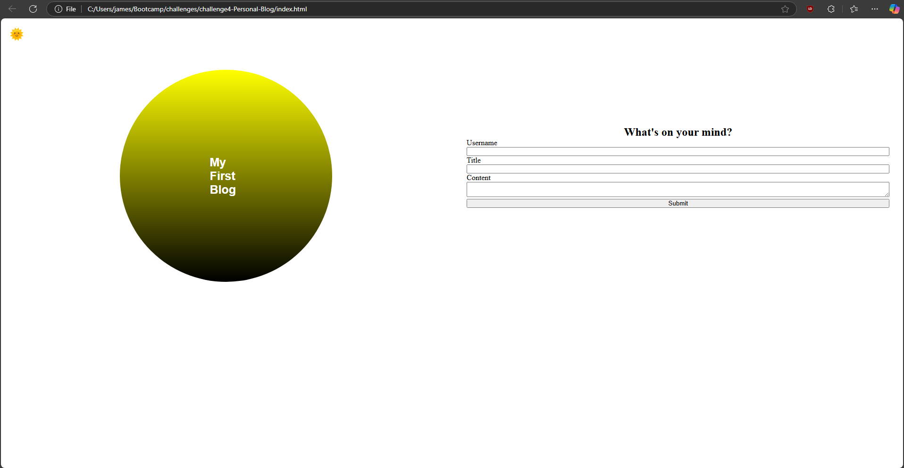
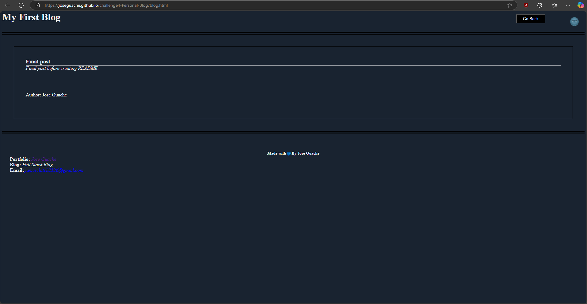

# challenge4 Personal Blog

## Description

This is a personal blog website that allows users to write and read blogs. It was created using HTML, CSS, and JavaScript.

## Features

- Write and read blogs
- Dark and light theme with a toggle button

## Technologies Used

- HTML
- CSS
- JavaScript

## Screenshots

**repo**

[GitHub Repo](https://github.com/JoseGuache/challenge4-Personal-Blog)

**live site**

[GitHub Pages](https://joseguache.github.io/challenge4-Personal-Blog/)

## Credits

[Professional README Guide](https://coding-boot-camp.github.io/full-stack/github/professional-readme-guide) - This guide was used to create the README.md file.

[MDN Web Docs](https://developer.mozilla.org/en-US/docs/Web/HTML) - This documentation was used to create the HTML.

[MDN Web Docs](https://developer.mozilla.org/en-US/docs/Web/CSS) - This documentation was used to create the CSS.

[MDN Web Docs](https://developer.mozilla.org/en-US/docs/Web/JavaScript) - This documentation was used to create the JavaScript.

## License

